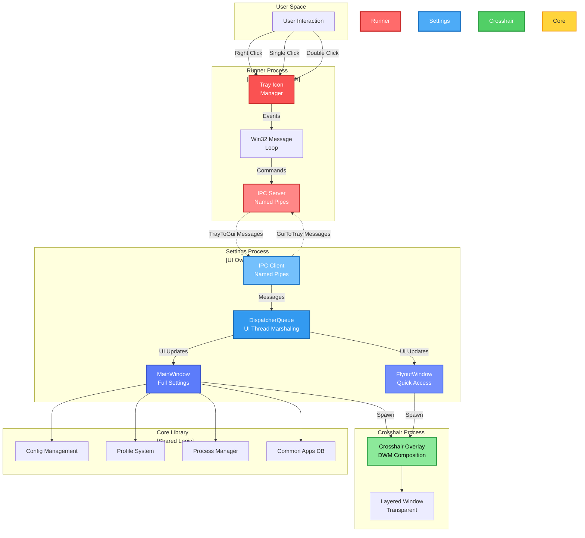
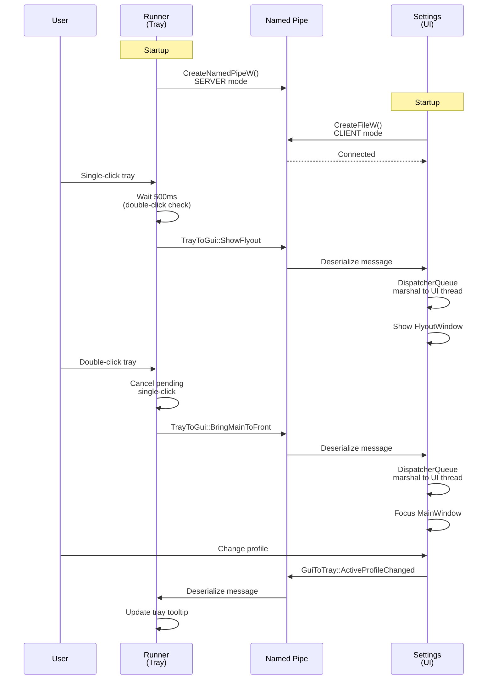
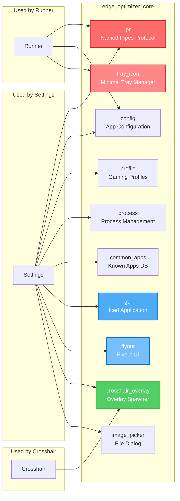
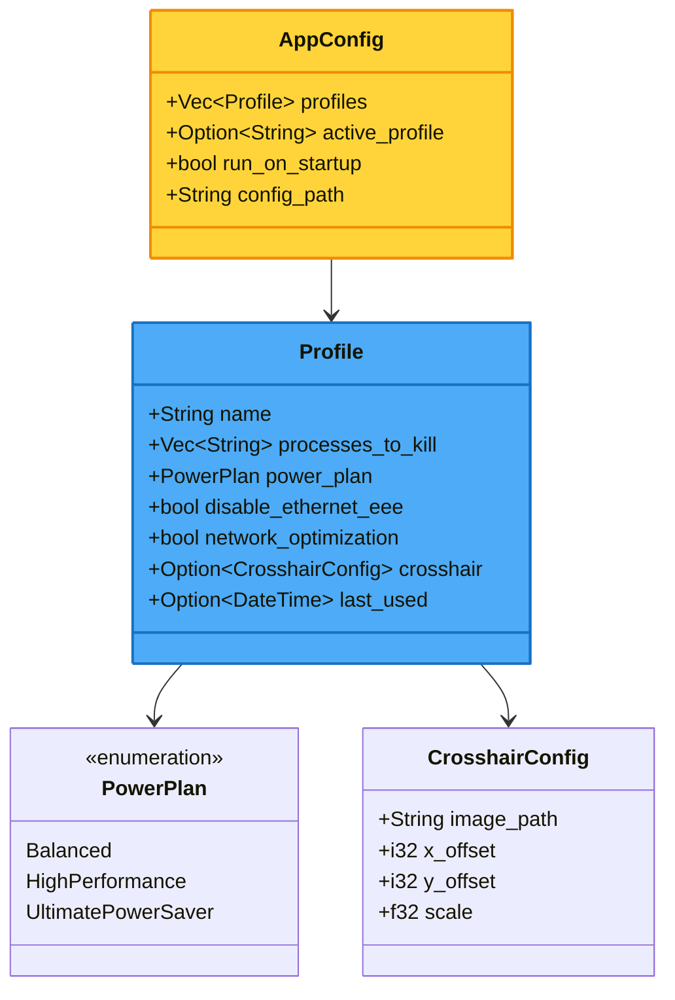
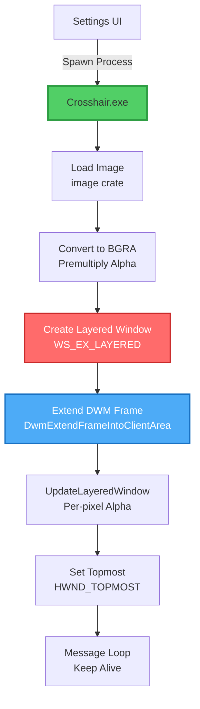
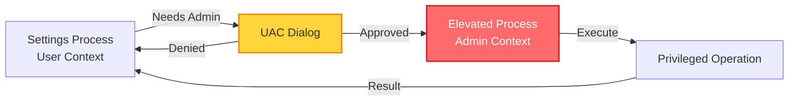

# EdgeOptimizer Design & Architecture

> High-performance Rust-based gaming optimization suite with multi-process architecture and IPC-based communication.

## 1. System Overview

EdgeOptimizer is designed as a **multi-process application** to ensure:
- **Isolation**: System tray management separate from UI rendering
- **Resilience**: UI crashes don't affect tray icon availability
- **Performance**: Each process optimized for specific tasks
- **Security**: Process isolation for privilege escalation when needed

### Core Capabilities
- Background process termination (non-essential apps)
- System performance tuning (power plans, network optimization)
- Crosshair overlays for FPS games (fullscreen-compatible)
- Network latency optimization for online gaming

---

## 2. Architecture Overview



**Key Design Principles:**
- **Red (Runner)**: Critical system tray management - must never crash
- **Blue (Settings)**: User interface - can be restarted without losing tray
- **Green (Crosshair)**: Independent overlay - spawned on-demand
- **Yellow (Core)**: Shared business logic - zero duplication

---

## 3. Process Architecture

### 3.1 Runner Process (`EdgeOptimizer_Runner.exe`)

**Purpose**: Persistent background service managing system tray icon

**Responsibilities**:
- System tray icon lifecycle (create, update tooltip, destroy)
- Context menu rendering (right-click)
- Click event detection (single/double click with 500ms timing)
- IPC server hosting (Named Pipes)
- Settings process spawning (when not running)

**Technology Stack**:
- `tray-icon` crate for system tray management
- Win32 message loop (`PeekMessageW`, `DispatchMessageW`)
- Named Pipes for IPC (`CreateNamedPipeW`)

**Click Detection Logic**:
```rust
// Single-click: ShowFlyout after 500ms (if no double-click)
// Double-click: BringMainToFront immediately (cancels pending single-click)
let is_double_click = now.duration_since(last_click_time) < 500ms;
```

---

### 3.2 Settings Process (`EdgeOptimizer_Settings.exe`)

**Purpose**: User interface for configuration and control

**Responsibilities**:
- MainWindow rendering (full settings application)
- FlyoutWindow rendering (quick access overlay)
- IPC client connection to Runner
- Profile management (create, edit, delete, activate)
- Process killing operations
- System optimization execution
- Crosshair process spawning

**Technology Stack**:
- `iced` GUI framework (declarative UI with Elm architecture)
- Named Pipes client (`CreateFileW`, `ReadFile`, `WriteFile`)
- `DispatcherQueue` for UI thread marshaling (not directly visible in Rust, handled by framework)

**Window Management**:
```
Settings Process
├── MainWindow (primary, always created)
│   └── Full settings interface
└── FlyoutWindow (on-demand, spawned by Runner)
    └── Quick access UI
    └── Auto-hide on focus loss
```

**Startup Modes**:
1. **Normal**: Show MainWindow immediately
2. **Flyout-only** (`--flyout-only`): Hide MainWindow, show FlyoutWindow
3. **Bring to front** (`--bring-to-front`): Focus existing MainWindow

---

### 3.3 Crosshair Process (`EdgeOptimizer_Crosshair.exe`)

**Purpose**: Fullscreen-compatible overlay for gaming crosshairs

**Responsibilities**:
- Image loading and rendering (PNG/JPG with alpha channel)
- Layered window creation (`WS_EX_LAYERED`, `WS_EX_TRANSPARENT`)
- DWM composition integration (fullscreen overlay support)
- Topmost window positioning (`HWND_TOPMOST`)

**Technology Stack**:
- Raw Win32 APIs (CreateWindowExW, UpdateLayeredWindow)
- DWM API (DwmExtendFrameIntoClientArea)
- `image` crate for loading PNG/JPG

**Window Flags**:
```rust
WS_EX_LAYERED       // Transparent blending
| WS_EX_TOPMOST     // Always on top
| WS_EX_TRANSPARENT // Click-through
| WS_EX_NOACTIVATE  // Never receives focus
| WS_EX_TOOLWINDOW  // Hidden from Alt+Tab
```

**Alpha Blending**:
- Premultiplied alpha for proper transparency
- UpdateLayeredWindow with `ULW_ALPHA` for per-pixel alpha

---

## 4. Inter-Process Communication (IPC)

### 4.1 Communication Protocol

**Transport**: Windows Named Pipes (`\\.\pipe\EdgeOptimizerIPC`)

**Serialization**: `bincode` (binary, more efficient than JSON)

**Pattern**: Bidirectional message passing



### 4.2 Message Types

**TrayToGui (Runner → Settings)**:
```rust
enum TrayToGui {
    ShowFlyout,              // Single-click: Show quick access
    HideFlyout,              // Click away: Hide quick access
    BringMainToFront,        // Double-click: Focus main window
    ActivateProfile(String), // Context menu: Activate profile
    DeactivateProfile,       // Context menu: Deactivate all
    ToggleOverlay,           // Context menu: Toggle crosshair
    OpenSettings,            // Context menu: Open settings
    Exit,                    // Context menu: Close app
}
```

**GuiToTray (Settings → Runner)**:
```rust
enum GuiToTray {
    ProfilesUpdated(Vec<Profile>),      // Rebuild context menu
    ActiveProfileChanged(Option<String>), // Update tooltip
    OverlayVisibilityChanged(bool),      // Update overlay state
    Shutdown,                             // Request Runner exit
}
```

### 4.3 Thread Safety

**Challenge**: UI elements must be modified on the UI thread

**Solution**: DispatcherQueue pattern (abstracted in `iced` framework)

```rust
// Conceptual pattern (handled by iced internally):
let msg = ipc_client.try_receive()?;
dispatcher_queue.try_enqueue(move || {
    // Now safely on UI thread
    match msg {
        TrayToGui::ShowFlyout => show_flyout_window(),
        TrayToGui::BringMainToFront => focus_main_window(),
        // ...
    }
})?;
```

---

## 5. Core Library (`edge_optimizer_core`)

Shared business logic to avoid code duplication.



### 5.1 Module Breakdown

| Module | Purpose | Used By |
|--------|---------|---------|
| `ipc` | Named Pipes protocol, message types | Runner, Settings |
| `config` | Load/save app configuration | All processes |
| `profile` | Gaming profile CRUD operations | Settings |
| `process` | List/kill processes, protected process filter | Settings |
| `common_apps` | Database of known background apps | Settings |
| `tray_icon` | Minimal tray manager (no UI dependencies) | Runner |
| `gui` | Main Iced application and state management | Settings |
| `flyout` | Flyout window component | Settings |
| `crosshair_overlay` | Spawn crosshair process | Settings |
| `image_picker` | File picker for crosshair images | Settings |

---

## 6. Profile System

Profiles define gaming optimization presets.



**Storage**: JSON file at `%APPDATA%\EdgeOptimizer\config.json`

**Operations**:
- Create: Add new profile with unique name
- Read: Load all profiles on startup
- Update: Modify profile settings, save immediately
- Delete: Remove profile, deactivate if active
- Activate: Apply optimizations, spawn crosshair, kill processes

---

## 7. Process Management

### 7.1 Protected Processes

**Critical Windows processes that CANNOT be killed**:
```rust
const PROTECTED_PROCESSES: &[&str] = &[
    "csrss.exe",    // Client Server Runtime
    "dwm.exe",      // Desktop Window Manager  
    "explorer.exe", // Windows Explorer
    "lsass.exe",    // Local Security Authority
    "services.exe", // Services Control Manager
    "smss.exe",     // Session Manager
    "system",       // System process
    "wininit.exe",  // Windows Init
    "winlogon.exe", // Windows Logon
    "svchost.exe",  // Service Host
];
```

### 7.2 Kill Operation Flow

```mermaid
stateDiagram-v2
    [*] --> ListProcesses
    ListProcesses --> FilterTarget: sysinfo::System
    FilterTarget --> CheckProtected: Normalize names
    CheckProtected --> Kill: Not protected
    CheckProtected --> Skip: Protected
    Kill --> Success: Process terminated
    Kill --> Failed: Access denied / in use
    Success --> Report
    Failed --> Report
    Skip --> Report
    Report --> [*]
    
    note right of CheckProtected
        Case-insensitive matching
        Strip .exe extension
        Safety first!
    end note
```

**Kill Report**:
```rust
struct KillReport {
    killed: Vec<String>,           // Successfully terminated
    failed: Vec<String>,           // Access denied or other error
    not_found: Vec<String>,        // Process not running
    blocklist_skipped: Vec<String>, // Protected processes
}
```

---

## 8. Crosshair Overlay System

### 8.1 Overlay Architecture

**Challenge**: Display overlay on fullscreen exclusive games

**Solution**: DWM Composition + Layered Windows (same technique as Discord, Xbox Game Bar)



### 8.2 Window Configuration

**Extended Styles**:
- `WS_EX_LAYERED`: Enable per-pixel alpha blending
- `WS_EX_TOPMOST`: Always render above game window
- `WS_EX_TRANSPARENT`: Click-through (mouse events pass to game)
- `WS_EX_NOACTIVATE`: Never steal keyboard focus
- `WS_EX_TOOLWINDOW`: Hidden from taskbar and Alt+Tab

**Positioning**:
```rust
// Center on screen + user offsets
let screen_width = GetSystemMetrics(SM_CXSCREEN);
let screen_height = GetSystemMetrics(SM_CYSCREEN);
let window_x = (screen_width - img_width) / 2 + x_offset;
let window_y = (screen_height - img_height) / 2 + y_offset;
```

### 8.3 Alpha Blending

**Premultiplied Alpha** (required for UpdateLayeredWindow):
```rust
for pixel in rgba.pixels() {
    let alpha = pixel[3] as f32 / 255.0;
    bgra_pixels.push((pixel[2] as f32 * alpha) as u8); // B
    bgra_pixels.push((pixel[1] as f32 * alpha) as u8); // G
    bgra_pixels.push((pixel[0] as f32 * alpha) as u8); // R
    bgra_pixels.push(pixel[3]);                        // A
}
```

**Why premultiply?**
- UpdateLayeredWindow expects premultiplied BGRA
- Prevents color bleeding on transparent edges
- Standard for all Windows layered window blending

---

## 9. System Optimizations

### 9.1 Power Plan Management

**Optimization**: Force High Performance power plan during gaming

**Implementation**:
```rust
// Windows Power Scheme GUIDs
const GUID_HIGH_PERFORMANCE: &str = "8c5e7fda-e8bf-4a96-9a85-a6e23a8c635c";

// Set active power scheme via powercfg
Command::new("powercfg")
    .args(&["/setactive", GUID_HIGH_PERFORMANCE])
    .output()?;
```

**Restoration**: Store previous plan, restore on profile deactivation

### 9.2 Network Optimization

**Ethernet Energy Efficient Ethernet (EEE) Disable**:
```rust
// EEE adds ~10-50ms latency when NIC wakes from low power
// Disable via registry for lower input delay
HKEY_LOCAL_MACHINE\SYSTEM\CurrentControlSet\Control\Class\
    {4d36e972-e325-11ce-bfc1-08002be10318}\<adapter_id>
    -> EEE = 0
```

**Other optimizations**:
- TCP window scaling
- Network throttling index reduction
- Interrupt moderation tuning

---

## 10. Error Handling & Logging

### 10.1 Error Strategy

**Library**: `anyhow` for application-level errors

**Pattern**: Fail fast with context, log errors, show user-friendly messages

```rust
fn load_profile(name: &str) -> Result<Profile> {
    let path = get_profile_path(name)
        .context("Failed to get profile path")?;
    
    let contents = std::fs::read_to_string(&path)
        .with_context(|| format!("Failed to read profile: {}", name))?;
    
    serde_json::from_str(&contents)
        .context("Failed to parse profile JSON")
}
```

### 10.2 Logging

**Framework**: `tracing` + `tracing-subscriber`

**Levels**:
- `ERROR`: Critical failures (IPC disconnected, profile load failed)
- `WARN`: Recoverable issues (process kill failed, config migration)
- `INFO`: Normal operations (profile activated, process killed)
- `DEBUG`: Development details (IPC messages, event handling)

**Configuration**:
```rust
tracing_subscriber::fmt()
    .with_max_level(tracing::Level::INFO)
    .init();
```

---

## 11. Build System

### 11.1 Workspace Structure

**Cargo Workspace** with 4 crates:
```toml
[workspace]
members = [
    "crates/core",      # Shared library
    "crates/settings",  # Settings GUI (depends on core)
    "crates/runner",    # Tray manager (depends on core)
    "crates/crosshair", # Overlay renderer (standalone)
]
```

**Benefits**:
- Single `cargo build` compiles all
- Shared dependencies cached
- Unified version management
- Cross-crate refactoring support

### 11.2 Resource Compilation

**Windows Resources** (`build.rs`):
```rust
// Embed icon and metadata into .exe
winresource::WindowsResource::new()
    .set_icon("resources/icon.ico")
    .set_manifest_file("resources/runner.manifest")
    .compile()?;
```

**Files**:
- `runner.rc`: Runner icon + metadata
- `settings.rc`: Settings icon + metadata
- `crosshair.rc`: Crosshair icon + metadata

### 11.3 Build Profiles

```toml
[profile.dev]
opt-level = 0          # No optimization, fast compile

[profile.release]
opt-level = 3          # Full optimization
lto = "fat"            # Link-time optimization
codegen-units = 1      # Single codegen unit for max performance
strip = true           # Remove debug symbols
```

---

## 12. Future Enhancements

### 12.1 Privilege Escalation

**Problem**: Some optimizations require admin rights (registry edits, service control)

**Solution**: UAC prompt on-demand, separate elevated process



### 12.2 Profile Automation

**Auto-activation** based on:
- Game process detection (`CreateToolhelp32Snapshot` monitoring)
- Scheduled times (e.g., "5 PM to 11 PM")
- Network activity patterns (heavy online gaming detected)

### 12.3 Advanced Overlays

- **FPS counter** (query DirectX/Vulkan frame times)
- **Network latency display** (ping monitoring)
- **CPU/GPU temperature** (WMI queries)
- **Multiple crosshairs** (per-game profiles)

### 12.4 Cloud Sync

- Profile backup to cloud storage (OneDrive, Google Drive)
- Cross-device profile sync
- Community profile sharing

---

## 13. Testing Strategy

### 13.1 Unit Tests

**Modules to test**:
- `process.rs`: Protected process filtering, name normalization
- `config.rs`: JSON serialization, migration logic
- `profile.rs`: CRUD operations, validation

```rust
#[cfg(test)]
mod tests {
    use super::*;

    #[test]
    fn test_protected_process_check() {
        assert!(is_protected("csrss.exe"));
        assert!(is_protected("CSRSS.EXE")); // Case-insensitive
        assert!(!is_protected("chrome.exe"));
    }
}
```

### 13.2 Integration Tests

**IPC Communication**:
1. Start Runner (mock)
2. Connect Settings
3. Send messages both directions
4. Verify correct deserialization

**Process Management**:
1. Spawn test processes (notepad.exe)
2. Kill via process manager
3. Verify termination

### 13.3 Manual Testing

**Tray Icon**:
- [ ] Single-click shows flyout
- [ ] Double-click opens main window
- [ ] Right-click shows context menu
- [ ] Tooltip updates on profile change

**Crosshair Overlay**:
- [ ] Visible over fullscreen games
- [ ] Click-through working
- [ ] Correct positioning with offsets
- [ ] Alpha blending correct

**Process Killing**:
- [ ] Target processes killed
- [ ] Protected processes skipped
- [ ] Error handling for access denied

---

## 14. Performance Considerations

### 14.1 Startup Time

**Target**: < 500ms for Settings UI

**Optimizations**:
- Lazy load profiles (only when needed)
- Async config loading (non-blocking UI)
- Minimal dependencies in hot path

### 14.2 Memory Usage

**Target**: < 50 MB per process

**Current**:
- Runner: ~15 MB (tray icon + IPC server)
- Settings: ~40 MB (Iced GUI + state)
- Crosshair: ~5 MB (single window + image)

### 14.3 IPC Latency

**Target**: < 10ms message round-trip

**Measurement**:
```rust
let start = Instant::now();
ipc_client.send(GuiToTray::ActiveProfileChanged(name))?;
let ack = ipc_client.receive_ack()?;
let latency = start.elapsed();
tracing::info!("IPC latency: {:?}", latency);
```

### 14.4 Crosshair Frame Rate

**Target**: 60 FPS (16.6ms per frame)

**Note**: Static crosshair = no updates needed after initial render
- No message loop processing except WM_QUIT
- Zero CPU usage in steady state

---

## 15. Security Considerations

### 15.1 Process Termination Safety

**Threats**:
- User accidentally kills critical system processes
- Malicious profile kills antivirus/security software

**Mitigations**:
- Hardcoded protected process list
- User confirmation dialog for bulk kills
- Logging of all kill operations

### 15.2 Configuration Integrity

**Threats**:
- Profile tampering (add malicious executables to kill list)
- Config file corruption (crash on load)

**Mitigations**:
- JSON schema validation on load
- Backup config before save
- Graceful fallback to default config

### 15.3 IPC Security

**Threats**:
- Rogue process connects to Named Pipe
- Message injection/tampering

**Mitigations**:
- Named Pipe access control (future: authenticate process ID)
- Message validation (deserialize with schema checks)
- Single-instance enforcement (mutex)

---

## 16. Dependencies

### 16.1 Core Dependencies

| Crate | Version | Purpose |
|-------|---------|---------|
| `iced` | 0.12 | GUI framework (declarative, Elm-inspired) |
| `tray-icon` | 0.14 | System tray icon management |
| `sysinfo` | 0.30 | Process listing and system info |
| `serde` | 1.0 | Serialization/deserialization |
| `serde_json` | 1.0 | JSON config storage |
| `anyhow` | 1.0 | Error handling with context |
| `tracing` | 0.1 | Structured logging |
| `image` | 0.24 | Image loading for crosshairs |
| `bincode` | 1.3 | Binary serialization for IPC |

### 16.2 Windows-specific

| Crate | Purpose |
|-------|---------|
| `windows` | Official Rust bindings for Win32 API |
| `winapi` | Legacy Win32 bindings (transitioning away) |
| `winresource` | Embed resources into .exe |

---

## 17. Deployment

### 17.1 Build Artifacts

```
EdgeOptimizer/
├── EdgeOptimizer_Runner.exe   (System tray manager)
├── EdgeOptimizer_Settings.exe (GUI application)
├── EdgeOptimizer_Crosshair.exe (Overlay renderer)
└── resources/
    ├── icon.ico
    └── default_crosshair.png
```

### 17.2 Installation

**Option 1: Portable**
- Extract to any folder
- Run `EdgeOptimizer_Runner.exe`
- Config stored in `%APPDATA%\EdgeOptimizer`

**Option 2: Installer** (Future)
- MSI/NSIS installer
- Auto-start with Windows
- Desktop/Start menu shortcuts

### 17.3 Auto-start Configuration

**Registry Key**:
```
HKEY_CURRENT_USER\Software\Microsoft\Windows\CurrentVersion\Run
-> EdgeOptimizer = "C:\Path\To\EdgeOptimizer_Runner.exe"
```

**Implementation**:
```rust
use winreg::RegKey;

fn enable_autostart(exe_path: &str) -> Result<()> {
    let hkcu = RegKey::predef(HKEY_CURRENT_USER);
    let run_key = hkcu.open_subkey_with_flags("Software\\Microsoft\\Windows\\CurrentVersion\\Run", KEY_SET_VALUE)?;
    run_key.set_value("EdgeOptimizer", &exe_path)?;
    Ok(())
}
```

---

## 18. GitHub Copilot Integration

### 18.1 Workspace Context

**Key files for context**:
- `.github/copilot-instructions.md` - Project guidelines
- `.github/design.md` - This document (architecture reference)
- `crates/core/src/lib.rs` - Module overview
- `Cargo.toml` - Dependencies and workspace structure

### 18.2 Common Copilot Queries

**For implementing new features**:
> "Add a new profile setting for disabling mouse acceleration, follow the existing profile structure in profile.rs"

**For refactoring**:
> "Extract the IPC message handling logic into a separate function to reduce duplication in runner/main.rs"

**For debugging**:
> "Why is the flyout window not showing after single-click? Check the IPC message flow and DispatcherQueue marshaling"

### 18.3 Code Navigation Hints

**Process spawning**:
- Runner spawns Settings: `crates/runner/src/main.rs` (search: "Command::new")
- Settings spawns Crosshair: `crates/core/src/crosshair_overlay.rs`

**IPC implementation**:
- Server side: `crates/core/src/ipc.rs` (NamedPipeServer)
- Client side: `crates/core/src/ipc.rs` (NamedPipeClient)

**UI rendering**:
- Main application: `crates/core/src/gui/mod.rs`
- Flyout component: `crates/core/src/flyout.rs`

---

## 19. Maintenance Guidelines

### 19.1 Adding New Profile Settings

1. Update `Profile` struct in `profile.rs`
2. Add UI controls in `gui/mod.rs`
3. Implement activation logic in `profile.rs::activate_profile()`
4. Update JSON schema version (if breaking change)
5. Add migration logic in `config.rs::migrate_config()`

### 19.2 Adding New IPC Messages

1. Define message variant in `ipc.rs` (TrayToGui or GuiToTray)
2. Add handler in Runner (`runner/main.rs`) or Settings (`gui/mod.rs`)
3. Update serialization tests
4. Document message flow in comments

### 19.3 Versioning Strategy

**Semantic Versioning** (SemVer):
- `MAJOR`: Breaking config changes (require migration)
- `MINOR`: New features (backward compatible)
- `PATCH`: Bug fixes only

**Config Versioning**:
```json
{
  "version": "1.0.0",
  "profiles": [...],
  "settings": {...}
}
```

---

## 20. Glossary

| Term | Definition |
|------|------------|
| **DWM** | Desktop Window Manager - Windows compositor |
| **IPC** | Inter-Process Communication - message passing between processes |
| **Named Pipe** | Windows mechanism for local IPC |
| **Layered Window** | Windows window type with per-pixel alpha blending |
| **DispatcherQueue** | Thread-safe mechanism to marshal operations to UI thread |
| **Premultiplied Alpha** | Color values pre-multiplied by alpha for correct blending |
| **UAC** | User Account Control - Windows privilege elevation |
| **EEE** | Energy Efficient Ethernet - power-saving feature that adds latency |
| **WM_QUIT** | Windows message indicating application shutdown |
| **HWND_TOPMOST** | Window flag for always-on-top positioning |

---

**Document Version**: 1.0  
**Last Updated**: 2026-01-26  
**Maintained By**: EdgeOptimizer Development Team
